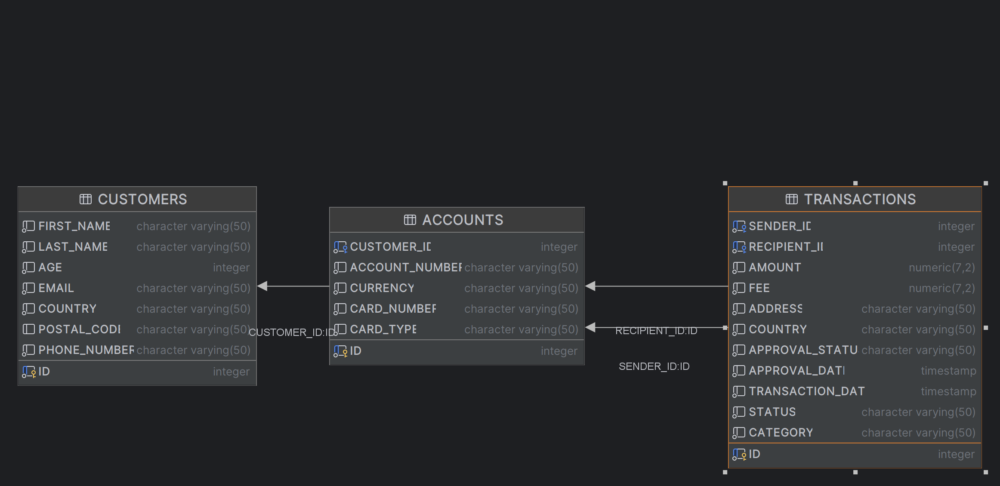

# 🚀 Dynamic Query Demo

This project was created to showcase power of JPA and QueryDSL and to sole two problems:

#### 1. Query maintainability 
   - **Problem** - It's relly hard to maintain handwritten SQL which have hundreds lines of code.
   - **Solution** - It's to use tools like JPA and QueryDSL which provides java abstraction for tables and queries.

#### 2. Query optimization
   - **Problem** - When querying large datasets every join and complex query adds more latency for end user.
   - **Solution** - QueryDSL have build-in logic to add joins depending on tables/columns that are used in query.

#### They are more benefits of using QueryDSL
1. Build-in protection against sql injection
2. Supports multiple schemas it's easy to implement archiving system
3. Have lots of build-in functions like ability to call procedures
4. It can be extended with own classes
5. Code can be easily shared across application/modules

## Table of Content
* [Quick Start](#quick-start)
* [SQL Schema](#sql-schema)
* [How it works](#how-it-works)
    * [Data record](#data-record)
    * [Column Mapping](#column-mapping)
    * [Query Fields](#query-fields)
    * [Query Service](#query-service)
      * [Build select statement](#build-select-statement)
      * [Build predicate](#build-predicate)
      * [Querying data](#querying-data)
    * [How generated SQL looks like](#how-generated-sql-looks-like)
* [How it can be extended](#how-it-can-be-extended)
  * [How to add new complex column](#how-to-add-new-complex-column) 
* [Improvements](#improvements)

## Quick Start

To run project, use intellij idea or install java locally.

```bash
# project don't have tests so you can skip them 😁
$ ./mvnw clean install -DskipTests
$ ./mvnw spring-boot:run
```

## SQL Schema

Main theme of the data is a bank 🏦 application that stores transaction information.

Schema is composed of three tables: `transactions`, `accounts` and `customers`.



More info here: `src/main/resources/schema.sql`.

## How it works

To be able to generate queries based on user input or predefined view app needs:
1. To have some kind of data record to store query result and to be bind to specific columns.
2. Definition of columns and their mappings.
3. Service that will generate select statement and predicate based on mapping and request info.

### Data record

In this case data record is `TransactionRecord` as mentioned above this record:
1. Hold query result.
2. Is being mapped field <=> column.
3. Is being used as response DTO.
4. Uses `@JsonInclude(JsonInclude.Include.NON_NULL)` to exclude all null fields from response.

```java
@JsonInclude(JsonInclude.Include.NON_NULL)
public record TransactionRecord(
        Long transactionId,
        BigDecimal transactionAmount,
        ...
) {}
```

### Column Mapping

To be able to map specific table column to data record I created `ColumnKey` enum.
* `fieldName` matches specific filed from `TransactionRecord`.
* `queryField` hold instance of `QueryField` to be able to create select expression and apply filters.

```java
public enum ColumnKey {
    TRANSACTION_ID("transactionId", new LongQueryField(Q_TRANSACTION.id)),
    TRANSACTION_AMOUNT("transactionAmount", new BigDecimalQueryField(Q_TRANSACTION.amount)),
    ...
    
    private final String fieldName; // must match name of field from TransactionRecord
    private final QueryField queryField;
}
```

### Query Fields

To be able to select specific column and to apply filter this abstract class `QueryField` was created.

By extending this class we can create custom filters or custom behaviours for select expression.

Examples: `BigDecimalQueryField`, `LongQueryField`, `SetQueryField`, `TextQueryField`

```java
public abstract class QueryField {
    // returns select expression, subclass can add custom logic here
    public abstract Expression<?> getExpression(); 
  
    // when proper FilterRequest is used then this method should add clause to BooleanBuilder
    // this logic is implemented by subclasses
    public abstract void applyFilter(BooleanBuilder builder, FilterRequest request); 
}
```

### Query Service

This service is responsible for generating queries and executing them.

#### Build select statement

To build select statement `buildProjection` method is called, it just iterates over fields from `TransactionRecord` and create select expression for field using `getSelectExpression`.

```java
private Expression<TransactionRecord> buildProjection(TransactionRequest request) {

    var selectExpressions = Arrays.stream(TransactionRecord.class.getDeclaredFields())
            .map(field -> getSelectExpression(field, request))
            .toArray(Expression<?>[]::new);

    return Projections.constructor(
        TransactionRecord.class,
        selectExpressions
    );

}
```

This method check if column mapping exists:
* if exist then calls `getExpression` from `QueryField`.
* otherwise it returns `Expressions.nullExpression(field.getType())` 

```java
private Expression<?> getSelectExpression(Field field, TransactionRequest request) {
    var columnDefOpt = ColumnKey.getByFieldName(field.getName());

    if (columnDefOpt.isEmpty()) {
        return Expressions.nullExpression(field.getType());
    }

    // some application specific constrain can be added here
    
    var columnDef = columnDefOpt.get();

    if (request.selectedColumns().contains(columnDef)) {
        return columnDef.getQueryField().getExpression();
    }

    return Expressions.nullExpression(field.getType());
}
```

#### Build predicate

To build predicate:
1. Instance of BooleanBuilder is created, when `.and` or `.or` method is called then builder adds this specific clause.
2. App iterate over all filters from `TransactionRequest` and `QueryField` add clause to builder. 

```java
private Predicate buildPredicate(TransactionRequest request) {
    var builder = new BooleanBuilder();

    if (request.filters() == null) {
        return builder.getValue();
    }

    request.filters()
            .forEach(filter -> filter.column()
                    .getQueryField()
                    .applyFilter(builder, filter));

    return builder.getValue();
}
```

#### Querying data

```java
  public List<TransactionRecord> getTransactions(TransactionRequest request) {
      return queryFactory
              .select(buildProjection(request)) // uses custom select steatment
              .from(QTransaction.transaction)
              .where(buildPredicate(request))   // uses custom predicate
              .limit(request.pageSize())
              .fetch();
  }
```

### How generated SQL looks like

Full examples of http requests, sql query and response you can find in `examples` directory.

## How it can be extended

### How to add new complex column

For example: business requested that they want new column `fxInd`:
- value `'Y'` when transaction sender currency is different from recipient currency
- value `'N'` when transaction sender currency is equal recipient currency

1. `TransactionRecord` - needs to be updated, new field `fxInd` has been added.
```java
public record TransactionRecord(
        String fxInd // new field
) {}
```

2. `ColumnKey` - needs to be updated to have new mapping
```java
public enum ColumnKey {
    ...
    FX_IND("fxInd", new SetQueryField(
            new CaseBuilder()
                    .when(Q_SENDER_ACCOUNT.currency.eq(Q_RECIPIENT_ACCOUNT.currency)).then("N")
                    .otherwise("Y"),
            Set.of("Y", "N")
    ))
}
```

## Improvements

### Create BaseQueryService

This class should be extended by `TransactionQueryService` and other services like this.

And some methods can be converted to generic one like:

```java
private <T> Expression<T> buildProjection(Class<T> dataRecordClass, Set<ColumnKey> selectedColumns) {...}
```

